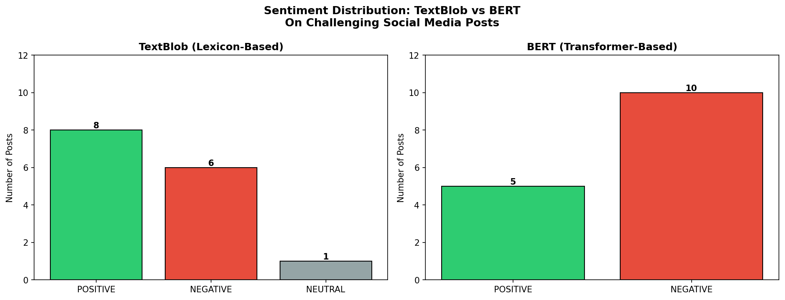
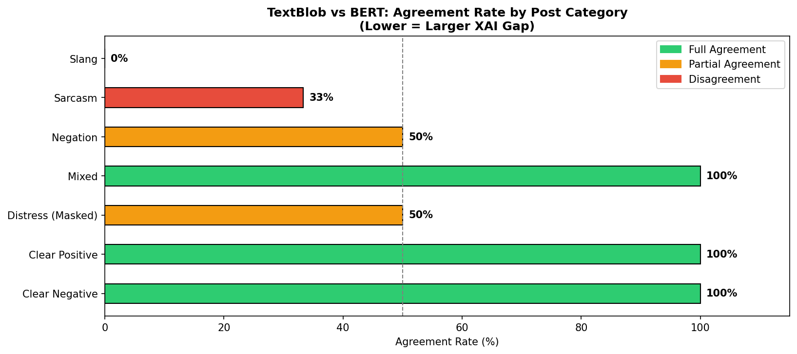
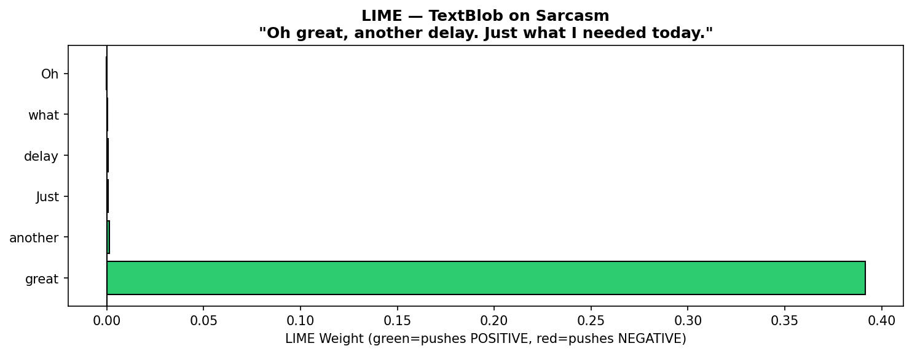
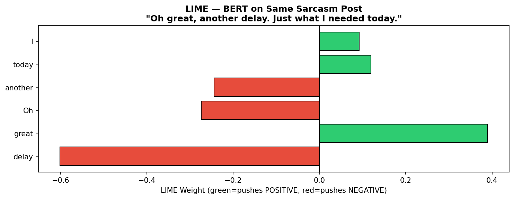

# 🔍 XAI Sentiment Analysis: LIME on TextBlob vs DistilBERT

[](https://python.org)
[](LICENSE)
[](https://zenodo.org)
[](https://jupyter.org)

> **Empirical experiment from the survey paper:**
> *"Explainability in Transformer-Based Sentiment Analysis: A Survey of Methods, Applications, and Open Challenges"*
> — Bhavishyasri Matangi, Dr. RVR & NRI Institute of Technology

---

## 📌 What This Project Does

This experiment applies **LIME (Local Interpretable Model-Agnostic Explanations)** to two contrasting sentiment analysis models:

| Model | Type | Description |
|-------|------|-------------|
| **TextBlob** | Lexicon-based | Assigns sentiment based on individual word polarity scores |
| **DistilBERT** | Transformer-based | Encodes full sentence context using bidirectional attention |

Both models are tested on **15 carefully selected social media posts** across 6 challenging categories — and their LIME explanations are compared to reveal the **XAI Gap**.

---

## 🧪 Key Finding

When tested on the sarcasm post:
> *"Oh great, another delay. Just what I needed today."*

| Model | Prediction | LIME Explanation |
|-------|-----------|-----------------|
| TextBlob | ✅ POSITIVE (wrong) | Entire decision driven by single word: **"great"** |
| DistilBERT | ✅ NEGATIVE (correct) | Weight distributed across: **delay(-0.60), Oh(-0.25), great(+0.40)** |

TextBlob completely missed the sarcasm. DistilBERT captured the contextual tension. **This is the XAI Gap in action.**

---

## 📊 Results

### Figure 1 — Sentiment Distribution


### Figure 2 — Model Agreement by Category


### Figure 3 — LIME on TextBlob (Sarcasm Post)


### Figure 4 — LIME on DistilBERT (Same Post)


---

## 📁 Repository Structure

```
XAI-Sentiment-LIME-Experiment/
│
├── paper.ipynb                 # Main experiment notebook
├── fig1_distribution.png       # Sentiment distribution comparison
├── fig2_agreement.png          # Model agreement by category
├── fig3_lime_textblob.png      # LIME explanation - TextBlob
├── fig4_lime_bert.png          # LIME explanation - DistilBERT
└── README.md                   # This file
```

---

## 🚀 How to Run

### Option 1 — Google Colab (Recommended, No Setup Needed)

1. Go to [colab.research.google.com](https://colab.research.google.com)
2. Click **File → Upload Notebook**
3. Upload `paper.ipynb`
4. Click **Runtime → Run All**
5. Wait ~5 minutes for BERT to download and all cells to execute

### Option 2 — Run Locally

**Prerequisites:**
- Python 3.8+
- Jupyter Notebook

**Step 1 — Clone the repository:**
```bash
git clone https://github.com/BhavishyasriMatangi-rgb/XAI-Sentiment-LIME-Experiment
cd XAI-Sentiment-LIME-Experiment
```

**Step 2 — Install dependencies:**
```bash
pip install lime transformers torch textblob matplotlib numpy scikit-learn
```

**Step 3 — Launch Jupyter:**
```bash
jupyter notebook paper.ipynb
```

**Step 4 — Run all cells in order** (Cell 1 through Cell 11)

> ⚠️ **Note:** Cell 5 downloads the DistilBERT model (~500MB) on first run. This takes 2–3 minutes. Subsequent runs are faster.

---

## 📦 Dependencies

```
lime
transformers
torch
textblob
matplotlib
numpy
scikit-learn
```

---

## 📂 Dataset

No external dataset required. The experiment uses **15 hand-crafted social media posts** covering:

| Category | Posts | Description |
|----------|-------|-------------|
| Clear Positive | 2 | Unambiguously positive sentiment |
| Clear Negative | 2 | Unambiguously negative sentiment |
| Sarcasm | 3 | Surface positive, actually negative |
| Negation | 2 | Contains negation words |
| Mixed Sentiment | 2 | Positive and negative in same post |
| Slang | 2 | Informal social media vocabulary |
| Masked Distress | 2 | Distress hidden behind neutral language |

---

## 📄 Related Paper

This experiment is the empirical contribution of the following survey paper:

> Matangi, B. (2026). *Explainability in Transformer-Based Sentiment Analysis: A Survey of Methods, Applications, and Open Challenges.* Zenodo. https://doi.org/10.5281/zenodo.XXXXXXX

*(Replace XXXXXXX with your actual Zenodo DOI after publishing)*

---

## 👩‍💻 Author

**Bhavishyasri Matangi**
Department of Information Technology
Dr. RVR & NRI Institute of Technology, Andhra Pradesh, India
Independent Researcher

🔗 [GitHub](https://github.com/BhavishyasriMatangi-rgb)

---

## 📜 License

This project is licensed under the **MIT License** — feel free to use, modify, and share with attribution.

---

## ⭐ If this helped you

Give it a star ⭐ on GitHub — it helps other researchers find this work!
